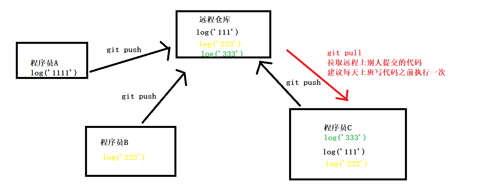
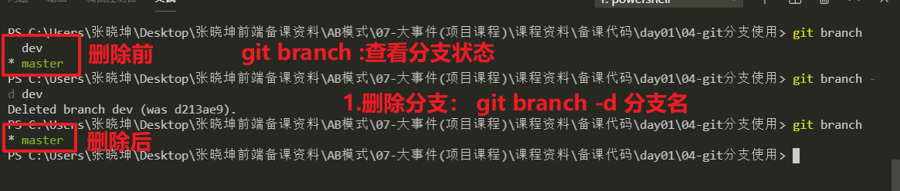

# 今日学习目标

# 01-git介绍及环境搭建

## 1.1-Git介绍

* 1.`Git`是什么？
  * `Git`版本控制系统`是`一个分布式的系统,`是`用来保存工程源代码历史状态的`命令行`==工具==
  
* 2.Git作用是什么？
  * 版本管理工具：说人话就是可以记录你敲代码的每一个环节(类似于玩游戏存档)
* 3.Git应用场景介绍
  * a. `多人开发`代码管理 ： 目前我们多人代码的时候，想把代码合并一起是利用最原始的复制粘贴操作。有了git之后，可以一键搞定
  * b.`异地开发`代码管理：实际开发中，我们上班可能会用公司电脑敲代码。有时候回到家里用自己电脑偷偷加个班，以前的做法是备一个U盘，复制粘贴。有了git之后，直接一键搞定。
  * c.`版本管理` ：比如我现在公司网站已经做出来了1.0版本在使用，现在计划增加一些新功能，但是这个功能不稳定需要经过开发和测试环节，为了不影响现有的稳定版本。以前的做法是把稳定版本单独拷贝一份增加功能，等做好之后再把以前版本给替换掉。有了git之后可以一键搞定。
  * d.`版本回滚`：比如这周产品经理提出一个功能，我辛辛苦苦写了一周代码。到了下周，产品经理说这个功能不做了，叫我删掉改成其他功能。我们把代码删掉之后按照产品经理要求又辛辛苦苦写了一周代码。到了下下周，产品经理说这个功能还是没有上次那个好，还是改成上周的吧…………
    * 别着急，有了git之后，一键搞定。
* 4.常见版本管理工具介绍
  * 1.git：目前使用最多的版本管理工具
  * 2.svn：也有公司在用，用法与git类似（相当于腾讯视频和优酷视频）

## 1.2-Git安装流程

* 1.打开备课资料-——>教学软件文件夹，根据电脑系统选择安装包（32位或者64位）

  * 全程默认点击即可，不用修改其他选项

  

* 2.如果在电脑任意文件夹中点击右键，能够出现Git命令选项，则说明安装成功

# 02-git工作流程与常用命令

| `Git命名`                                        | `作用`                                        | `详细描述`                                   |
| ------------------------------------------------ | --------------------------------------------- | :------------------------------------------- |
| git init                                         | 初始化git仓库（类似于玩游戏新建一个存档文件） | 在当前文件夹中新建一个 .git隐藏文件夹        |
| git add .                                        | 添加文件信息（相当于游戏开始存档）            | 把要提交的文件的信息添加到暂存区中（`常用`） |
| git commit -m"描述信息"                          | 确认添加信息 (确认存档)                       | 将暂存区中的文件提交到本地仓库中（`常用`）   |
| git config --global user.email "you@example.com" | 设置邮箱                                      | 第一次使用git会让你输入邮箱                  |
| git config --global user.name "Your Name"        | 设置用户名                                    | 第一次使用git会让你输入用户名                |
| git reset --hard 版本号                          | `版本回滚`(游戏回档)                          | 可以让你的文件回退到历史某一个版本           |
| git  log                                         | 查看详细日志(存档日志)                        | 会显示你的每一次存档信息                     |
| git  log --oneline                               | 查看简略版日志                                | 快速查看版本号                               |
| git reflog                                       | 查看所有日志(包含回滚日志)                    | 回档回错了会用到                             |

* 课后学习传送门：https://www.jianshu.com/p/93318220cdce

### 问题点总结

* 1.新建项目的文件夹,要进到文件夹里面去之后, 右键点击git bash here

* 2.git init 不要写错, 出现一个.git隐藏文件夹, 如果没有出现这个文件夹,检查一下自己的电脑隐藏文件夹是不是不显示.

  * 如果不小心项目文件夹建错了，就可以删掉.git文件夹，相当于删档操作（慎用）
  * git一次只能写一个命令，千万不要两个命令连着写

* 3.注意每一个命令之间的空格

  git add .

  git commit -m"描述的信息"

  这两句代码  add 和后面的点 有空格.   commit 和-m中间也有空格.

* 4.第一次提交会出现让你输入邮箱和用户名, 一行代码一行代码的执行. 复制的时候不要把后面的空格给复制

  * git不能按快捷键CTRL+CV来复制，要选中之后点击右键通过copy和paste来复制粘贴

* 5.有时候git命名行工具会卡死： 多按几次 q 键就可以退出卡死(相当于卡屏修复)

## ==1.1-主要工作流程总结==

* ==123步一个项目只需要一次，456步频繁使用，789步偶尔会用,10步第一次使用git需要设置==
  * 1.新建项目文件夹
  * 2.进入文件夹
  * `3.初始化仓库：git init`
  * `4.编码`
  * `5.添加文件信息： git add .`
  * `6.确认添加信息：git commit -m"描述信息"`
  * 7.查看详细日志信息：git log
  * 8.查看简略日志信息：git log --oneline
  * 9.版本回滚:git reset --hard 版本号
    * 通过查看历史提交日志信息就可以找到版本号
  * 10.设置邮箱和用户名
    * 设置邮箱：git config --global user.email "you@example.com"
    * 设置用户名: git config --global user.name "Your Name"

### 1.新建文件夹

### 2.进入这个文件夹,点击右键选择Git Bash Hear，打开git命令行工具

### ==3.输入命令 `git init`初始化git仓库==

* ==456三个步骤是开发中不断重复的环节==

### ==4.编码==

### ==5.添加存档：使用`git add .`==

* 注意：这个命令只是将文件信息添加到暂存区，还没有真正存档，需要使用git commit命令确认存档才可以

### ==6.确认存档:使用`git commit -m"描述信息"`==

### 7.查看详细提交信息：`git log`

### 8.查看简略信息:`git log --oneline`

### 9.版本回滚:`git reset --hard 版本号`

* git reflog：这个命令可以查看你曾经回滚的记录

### 10-设置邮箱和用户名

* 设置邮箱：` git config --global user.email "you@example.com"`
* 设置用户名:`git config --global user.name "Your Name"`

* 一般第一次使用git都会弹出下面一个小提示 ： 告诉你没有设置邮箱和用户名。
  * 只需要设置一次，以后就不会有提示了

# 03-git远程仓库使用流程

## 1.1-远程仓库介绍

* 1.什么是远程仓库？
  * 远程仓库其实就是远程的服务器，帮我们存储代码的
    * 本地git存储：一旦你电脑丢了或者硬盘损坏，直接扑街
    * 远程git存储：如果你电脑坏了换了一个新的，只需要从网上重新下载即可
* 2.常见的远程仓库有哪些？
  * （1）github：免费
    * 学习时候可以用，工作中有的小公司为了省钱也会用
  * （2）gitlab
  * （3）码云
  * （4）你们公司自己机房的服务器（工作中遇到）
    * 以上远程仓库使用流程几乎一致
* 3.什么是GitHub？https://github.com/
  * 1.是一个免费的远程代码托管仓库
  * 2.是一个代码托管平台,很多优秀的开源的项目都有放在github上,供大家学习/使用.
    * 在这个网站可以找到很多别人写好的框架，例如jQuery，art-template这个上面都有
  * 3.全球最大代码托管平台，由于使用者几乎都是男性。于是自嘲："全球最大的同性交友网站"
  * 4.github和git是什么关系呢？
    * 没有半毛钱的关系，只是名字有点像而已。例如北大和北大某鸟的关系。
      * git是一个命令行工具，用于代码版本管理
      * gitthub是一个网站的名字：免费服务器帮别人存东西的（主要存代码）

## 1.2-远程仓库使用流程

### 1.在github网站`建立远程仓库`

### 2.将远程仓库`克隆到本地`

### 3.`本地编写代码`： git add . 与git commit -m添加文件信息

### 4.将本地代码`推送到远程`(每天下班一次)

* `git push`

### 5.将远程代码`拉取到本地`（每天上班一次）

* `git pull`
  * git pull:拉取，用于多人开发。比如别人写的代码文件提交到远程仓库，通过这个命令就可以将远程仓库代码拉取到本地
    * 这个命令不会拉取所有代码，只是拉取远程上面新增的代码（把别人写的代码合并到你的本地）
    * 这个命令，在多人开发的时候建议`每天`上班前执行`一次`
  * git clone:克隆，将整个远程仓库克隆到本地
    * 这个命名相当于拉取所有的代码(将整个远程仓库文件夹copy到你的本地)
    * 这个命令一般只会在`项目开始`的时候`执行一次`

* 如何将本地文件夹关联远程仓库
  * 1.在github创建空仓库
    * 不要勾选那个readme
  * 2.在本地文件夹中执行命名：git remote add origin 仓库地址
  * 3.最后执行：git push -u origin master

## 1.3-如何删除远程仓库

* 1.找到你要删除的远程仓库
* 2.点击Settings

* 3.往下滚动页面，找到删除选项

* 注意：删除之后就找不回来这个远程仓库了。但是我们本地代码还是在自己电脑上的，我们可以再建立一个远程仓库来关键本地的代码。具体步骤如下

* 首先，新建一个空仓库(不要勾选那个README选项)

* 执行命令：git remote add origin 仓库地址
* 执行命令：git push -u origin master

# 04-git补充知识点（辅助工具使用）

## 1.1-git其他辅助工具使用

* git命令行工具有很多，他们只是界面不一样

* 1.vscode自带的终端窗口
  * * 命令行都是一样的，只是这个窗口直接在你文件下方显示，不用单独开一个小窗口了
* 

* 2.vscode自带了图形化工具
  * 选中你要add的文件, 点加号,  就相当于git add .
  * 点击勾勾√  , 就相当于  git commit -m""
  * 点击...后,选择推送  ,  就相当于是git push

* 3.GitHubDeskTop  章鱼猫 （Github官方出品的一款git桌面软件）
  * https://desktop.github.com/

## 1.2-Github制作个人网站主页流程

* 1.新建一个远程仓库
  * ***注意：个人主页这个远程仓库的名字是固定的，不能随便乱写：`用户名.github.io`***

* 2.把远程仓库克隆到本地
* 3.新建一个`index.html`页面
  * 文件名固定为index.html,这个就是你的个人主页
* 4.制作完成之后，将你的本地代码推送到github远程服务器即可

* 5.浏览器输入网址:`用户名.github.io`就是你的个人主页地址

# 05-git分支使用流程

## 1.1-分支介绍

* 1.什么是分支？
  * 分支(branch)相当于给你的远程仓库(主分支master)代码copy一份，然后我们在这个copy的代码上进行开发。等功能做好之后，再把分支的代码推送到主分支.
* 2.为什么要有分支？
  * a.举例1：比如你的网站第一个版本已经做好发布了，功能也很稳定。现在准备新增一些功能开发2.0版本，这时候如果你在原本稳定代码上工作，万一出现bug就会对原先稳定的代码造成影响。所以我们需要将原先代码copy一份进行开发，等2.0版本功能做好之后再和原先的1.0代码合并（相当于发布2.0正式版本）
  * b.举例2：比如你的项目1.0版本已经正式上线，然后突然出现了bug，如果我们直接在原先代码修复，就会影响其他功能。一般我们就可以建立一个分支（把原代码copy一份），等bug修复完毕之后。再与主分支合并，这样就可以很好的修复bug。一般这种版本称之为 1.x (1.1 、1.2、 1.3)

## 1.2-分支使用流程

### 1.`新建仓库`,就会有一个默认的master分支

### 2.`新建分支`   git branch 分支名

### 3.`切换分支` git checkout 分支名 （创建分支之后，你的代码默认还是在主分支，需要切换工作分支到子分支）

### 4.`在新的分支上进行编码`

* git add .

* git commit -m“描述信息”

### 5.`合并分支`（功能做完了，开始发布正式版本了，就把分支代码合并到主分支）

*** 注意：合并分支，需要把当前工作分支切换到主分支才可以 ***

### 6.`删除分支`：`git branch -d 分支名` (慎用)

* ***注意：删除分支，也需要切换当前工作分支为主分支***
* git branch ： 查看当前仓库的分支状态

## 1.3-章鱼猫软件使用分支流程

* 1.创建分支

* 2.合并分支
  * 需要切换到主分支

* 3.删除分支

